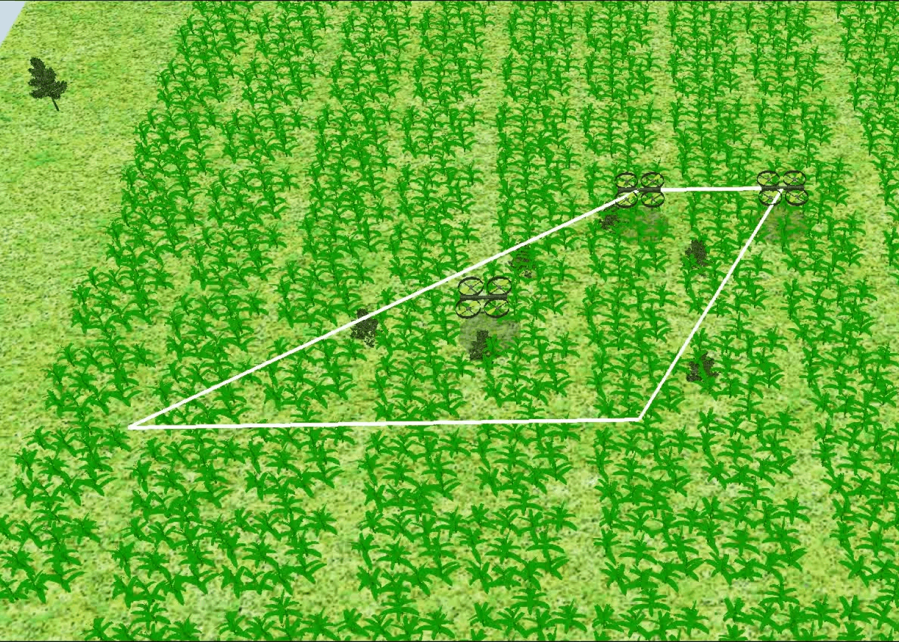

# Formal Analysis on Environment Design for Multi-Robot Navigation using Reinforcement Learning

<p align="center">
  
  
</p>

This repository contains the official implementation for the paper:

**Formal Analysis on Environment Design for Multi-Robot Navigation using Reinforcement Learning**

We develop a scalable MDP-based simulation framework for multi-robot navigation and path planning under continuous control. The framework supports:

- Multi-UAV systems  
- Multi-wheeled robot systems  
- Parallel training with vectorized environments  
- Multiple deep reinforcement learning algorithms  

---

# Setup

We recommend running this project on Linux.

All required dependencies are provided in `environment.yaml`.

## Create the conda environment

```bash
conda env create -f environment.yaml
conda activate <environment_name>
```

If you modify the environment:

```bash
conda env export --no-builds > environment.yaml
```

---

# Experiment Sets

Experiment configurations are stored in:

```
exp_sets/
    ├── uav/
    │     └── cont_sets.json
    └── wheeled/
          └── envX.ini
```

- UAV environments are loaded from JSON files.
- Wheeled robot environments are loaded from `.ini` files.

---

# Training

Training supports both UAV and wheeled robot environments.

Supported algorithms:

- `A2C`
- `PPO`
- `TRPO`
- `ARS`
- `CrossQ`
- `TQC`

---

## Basic Training

### Train UAV

```bash
python train.py --algorithm CrossQ --robot_type uav --set 3 --num_robots 3
```

### Train Wheeled Robot

```bash
python train.py --algorithm PPO --robot_type wheeled_robot --set 1
```

---

## Full Training Command

```bash
python train.py \
    --algorithm {A2C,PPO,TRPO,ARS,CrossQ,TQC} \
    --robot_type {uav,wheeled_robot} \
    --set [set number] \
    --num_robots [int, UAV only] \
    --verbose {0,1,2} \
    --steps [training steps] \
    --num_envs [parallel envs] \
    --seed [seed] \
    --log_steps [logging interval] \
    --resume {True,False} \
    --use_tuned_params {True,False} \
    --device {cpu,cuda}
```

---

## Logs and Checkpoints

Training logs are saved in:

```
logs/
    ├── training_default_logs/
    └── training_best_logs/
```

Each run creates:

```
logs/.../<robot>_<algorithm>_setX_seedY_v0/
    ├── tensorboard/
    ├── checkpoints/trained_model.zip
    ├── log.txt
    ├── progress.csv
    └── progress.json
```

---

## View Training Results

```bash
tensorboard --logdir=logs
```

---

# Resume Training

```bash
python train.py \
    --algorithm CrossQ \
    --robot_type uav \
    --set 3 \
    --resume True
```

---

# Hyperparameter Tuning

**For UAVs:**
```bash
python3 tune.py --algorithm A2C --robot_type uav --set 1 --num_robots 3
```

**For Wheeled Robots:**
```bash
python3 tune.py --algorithm A2C --robot_type wheeled_robot --set 1
```

The currently implemented algorithms are `A2C`, `PPO`, `TRPO`, `TQC`, `ARS`, and `CrossQ`.  
The `--set` parameter depends on the number of sets in the `exp_sets` directory.  
The `--num_robots` parameter is only used for UAVs, as wheeled robot experiments have a fixed number of robots in the configuration files.  

Tuning can be further configured using the following command format:

```bash
python3 tune.py \
    --algorithm {A2C, PPO, TRPO, TQC, ARS, CrossQ} \
    --robot_type {uav, wheeled_robot} \
    --set [set number] \
    --num_robots [number of UAVs, if robot_type is uav] \
    --trials [number of tuning trials] \
    --steps [number of training steps per trial] \
    --num_envs [number of parallel environments] \
    --num_eval_eps [number of episodes for evaluation] \
    --seed [random seed] \
    --log_steps [logging interval] \
    --device {cpu, cuda}
```

# Simulation

Train a model before running simulation, or use the pretrained models. 

---

## PyGame Simulation

The command `python run.py` will run a trained model using 3 robots in Pygame. For running simulation on a custom trained model, use the following command format:

```bash
python run.py --path ".\trained_models\uav\cont_env1_2robots_CrossQ.zip" --algorithm CrossQ --robot_type uav --set 1 --num_robots 2
```

---

## CoppeliaSim Simulation

We use CoppeliaSim for realistic 3D simulation. 

### Step 1: Install CoppeliaSim

Download from:  
https://coppeliarobotics.com/

### Step 2: Open Scene

Open the following file in the CoppeliaSim Simulator:

```
coppeliasim_envs\uav_common_env.ttt
```

**Important**:
- Reopen the scene before every run.
- Do NOT save changes when closing.

### Step 3: Run Simulation

The command `python run.py --simulate True` will run a trained model using 3 robots in CoppeliaSim. For running simulation on a custom trained model, use the following command format:
```bash
python run.py --path ".\trained_models\uav\cont_env1_2robots_CrossQ.zip" --algorithm CrossQ --robot_type uav --set 1 --num_robots 2 --simulate True
```

---

# Training on Compute Clusters (Slurm)

Slurm scripts are provided in the directory:

```
slurm_scripts/
```

### Run all training jobs

Run:

```bash
sbatch slurm_scripts/train_all.sh
```

### Run a single environment

Edit and run:

```bash
slurm_scripts/train_one_env.sh
```

### Run a single algorithm

Edit and run:

```bash
slurm_scripts/train_one_alg.sh

---

# Plotting

To visualize experiment layouts, please use the notebooks in the `plotting` folder.

---

---

# Notebooks

To ease-up the simulation, we provide various notebooks for both UAVs and wheeled robots in the `notebooks` folder.

---